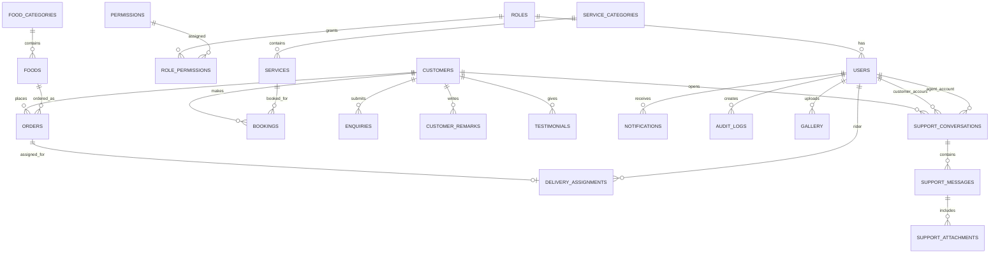
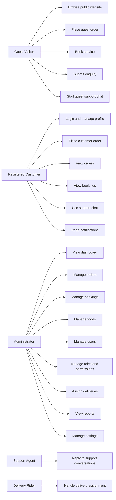
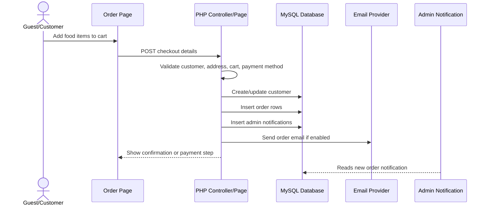
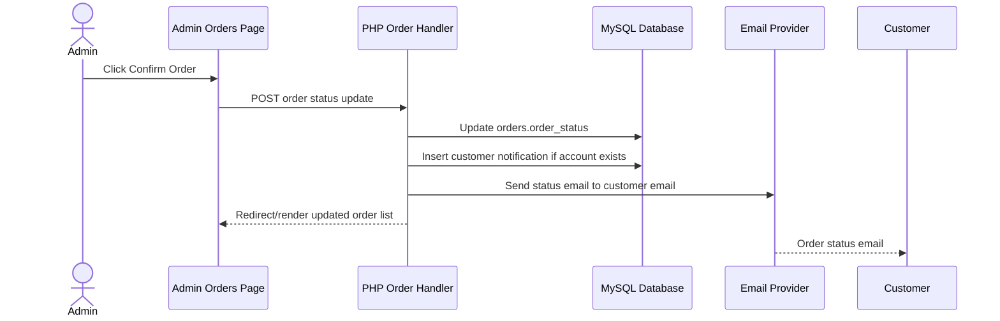
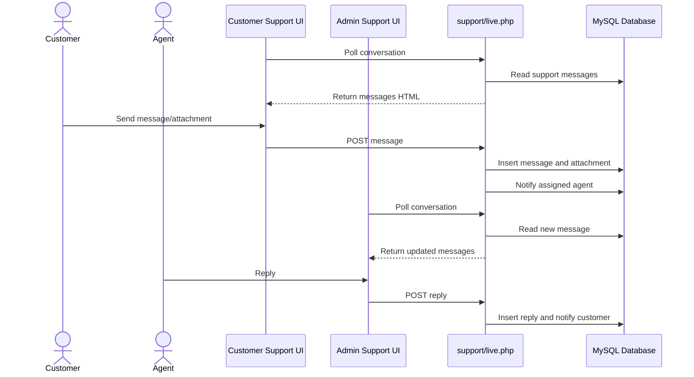
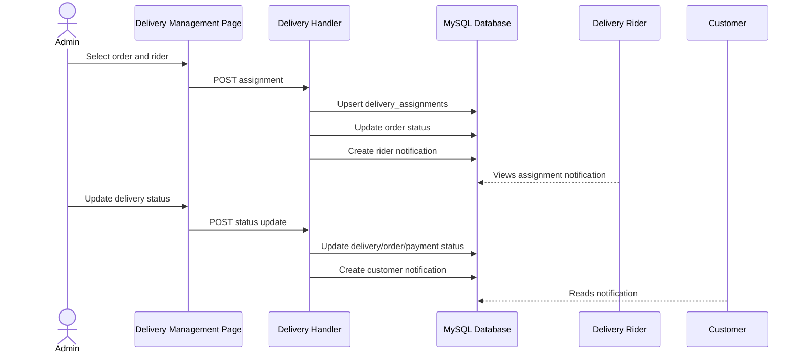

# AfriSense Food Services - System Design Documentation Source

This document is a source document for the final Microsoft Word/PDF project report. It is based on an audit of the live PHP/XAMPP application and the `afrisense_db` MySQL database.

## 1. Project Summary

AfriSense Food Services is a full-stack web application built with PHP, MySQL, HTML, CSS, and JavaScript. The system supports public visitors, registered customers, administrators, support agents, and delivery riders. It provides food ordering, service booking, customer enquiries, support chat, order management, delivery management, role/permission management, notifications, reports, and configurable website settings.

The application runs locally on XAMPP and uses phpMyAdmin/MySQL for data storage. It follows a modular structure with reusable frontend layouts/components and backend model/controller/helper classes.

## 2. Assignment Alignment

The CPS 218 project brief requires a full-stack web-based application for AfriSense Technology with:

- A responsive frontend using HTML, CSS, and JavaScript.
- Food order and service booking forms.
- Enquiries/contact forms with validation.
- Menu display and service pages.
- PHP and MySQL backend.
- Admin authentication and role management.
- Food/service CRUD.
- Admin management of orders, bookings, and enquiries.
- Dashboard analytics.
- Reusable code structure.
- Client-side validation and server-side sanitisation.
- Optional email notifications.
- Documentation including UML diagrams and ERD.

The current AfriSense implementation satisfies these requirements through its landing/customer/admin interfaces, MySQL database, role-based access, email notification flow, and modular PHP structure.

## 3. Technology Stack

| Layer | Technology |
|---|---|
| Frontend | HTML5, CSS3, JavaScript |
| Backend | PHP 8 style code with PDO |
| Database | MySQL/MariaDB through XAMPP/phpMyAdmin |
| Server | Apache via XAMPP |
| Authentication | PHP sessions, password hashing, email verification |
| Email | Resend API or SMTP fallback settings |
| Assets | CSS, JavaScript, images, uploaded food/gallery/support files |
| Local URL | `http://localhost/Afrisense` |
| Database | `afrisense_db` |

## 4. High-Level Architecture

The system uses a PHP server-rendered architecture:

1. Browser requests public, customer, or admin PHP pages.
2. PHP pages include shared bootstrap files.
3. The bootstrap creates a PDO database connection.
4. Pages call helpers/models/controllers to read or mutate data.
5. HTML is rendered using reusable layouts and components.
6. JavaScript improves interaction, validation, cart behavior, live support polling, sounds, previews, and UI behavior.
7. MySQL stores users, customers, orders, bookings, support conversations, notifications, settings, and content records.

### Main Directories

| Directory | Responsibility |
|---|---|
| `frontend/landing` | Public pages for menu, order, cart, booking, support, contact, enquiries, remarks, gallery, terms, and privacy. |
| `frontend/customer` | Authenticated customer dashboard, orders, bookings, support, profile/settings, notifications, cart, and payment. |
| `frontend/admin` | Admin dashboard, orders, bookings, users, roles, permissions, customers, foods, gallery, reports, delivery management, support, enquiries, remarks, notifications, and settings. |
| `frontend/components` | Reusable sidebars, headers, navbars, alerts, footer, loader, and modal components. |
| `frontend/layouts` | Public, customer, and admin layout wrappers. |
| `frontend/assets` | CSS, JavaScript, audio files, images, and static UI assets. |
| `frontend/includes` | Shared public settings, support helpers, remarks helpers, theme helpers. |
| `frontend/auth` | Login, registration, logout, email verification, forgot/reset password, and auth bootstrap. |
| `backend/models` | Generic backend models such as User, Role, Permission, Auth, Notification, Settings, AuditLog, Dashboard. |
| `backend/controllers` | API-style controllers for auth, users, roles, permissions, notifications, settings, and dashboard. |
| `backend/helpers` | Session, security, validation, response, and upload helpers. |
| `backend/middleware` | Authentication, admin, and permission middleware. |

## 5. User Roles and Actors

### Actors

| Actor | Description |
|---|---|
| Guest Visitor | Can browse public pages, order as guest if enabled, create enquiries, book services, submit remarks, and start support chat. |
| Registered Customer | Can log in, order within customer area, view orders/bookings, manage profile, view notifications, and use support chat. |
| Administrator / Super Admin | Has full access to dashboard, orders, bookings, users, roles, permissions, foods, reports, settings, delivery, support, and enquiries. |
| Support Agent | Can access support conversations. If no support agent exists, admin becomes default support agent. |
| Delivery Rider | Assigned to deliveries through delivery management role and workflow. |

### Role System

Roles are stored in `roles`. Users belong to one role through `users.role_id`. Permissions are stored in `permissions`, and role-permission mappings are stored in `role_permissions`. The application seeds and manages permissions through the admin permissions page.

Core roles include:

- Super Admin / Administrator
- Manager
- Kitchen Staff
- Cashier
- Customer Support / Support Agent
- Delivery Rider
- Customer
- Corporate Customer

## 6. Core Functional Modules

### 6.1 Public Website

Public pages provide marketing and customer entry points:

- Home page
- About page
- Menu page
- Food order page
- Cart and checkout/payment pages
- Service booking page
- Contact page
- Enquiries page
- Remarks/reviews page
- Gallery page
- Terms and privacy pages
- Guest support page

### 6.2 Customer Portal

Registered customers can:

- View dashboard statistics.
- Place food orders without losing customer navigation.
- View order history and order details.
- Book services.
- Manage profile and password.
- View notifications.
- Start or continue support conversations.
- Submit remarks/reviews.

### 6.3 Admin Portal

Administrators can:

- View dashboard metrics.
- Manage all orders and order statuses.
- Confirm, prepare, deliver, cancel, reopen, and update payment status.
- View customer email/contact details in order details.
- Create new internal orders.
- Manage bookings.
- Manage enquiries and replies.
- Manage customers and users.
- Create roles and assign permissions.
- Manage foods and food categories.
- Manage gallery/media.
- View reports and analytics.
- Manage delivery assignments and riders.
- Reply to support chats.
- Manage website/company/payment/email/delivery settings.

### 6.4 Food Ordering

Both guest and registered customer order flows use cart/session behavior:

1. User browses available foods.
2. User adds items to cart.
3. User enters customer/contact/delivery details.
4. User selects payment method.
5. If payment method is Cash on Delivery, the order proceeds without pay-now gateway flow.
6. If payment method is Mobile Money/Card, the payment flow is shown.
7. System creates or updates a customer record.
8. System creates one or more order rows.
9. System creates admin notifications.
10. System sends customer/admin email notifications if enabled.

### 6.5 Service Booking

Service booking allows guests and customers to:

1. Select a service.
2. Enter event date, time, location, number of guests, and special requests.
3. System creates or updates a customer record.
4. System inserts booking record.
5. Admin manages status as Pending, Confirmed, Completed, or Cancelled.

### 6.6 Enquiries

Customers and guests can submit enquiries. Admin can:

- View enquiry list.
- Filter by status.
- Reply.
- Mark as read/replied/closed.
- Delete or bulk update records.

### 6.7 Support Chat

Support chat uses database-backed polling through `frontend/support/live.php`.

Current design:

- Guests use a session-based public token.
- Registered customers use their user id.
- Admin/support agents use admin context.
- Messages are stored in `support_messages`.
- Attachments are stored in `support_attachments`.
- Conversations are stored in `support_conversations`.
- Image and video attachments are previewed.
- Sent and received notification sounds are played by the frontend.
- The endpoint is polled for updates rather than using WebSockets.

Recommended future enhancement:

- Replace or supplement polling with WebSocket, Server-Sent Events, Pusher, or Socket.IO for true real-time delivery.

### 6.8 Delivery Management

Delivery management connects orders to riders:

1. Admin selects an order.
2. Admin assigns a Delivery Rider.
3. System creates/updates `delivery_assignments`.
4. Delivery status can move through Pending, Assigned, Picked Up, In Transit, Delivered, Returned, or Cancelled.
5. Order status and payment status can be updated during delivery.
6. Rider/customer notifications are created.

### 6.9 Notifications and Email

In-app notifications are stored in the `notifications` table. Email notifications use `afrisense_send_email`, configured for Resend or SMTP settings.

Notification examples:

- New order received.
- Order confirmed/cancelled/delivered.
- Booking status update.
- Enquiry reply.
- Support message.
- Delivery assignment/status update.
- Email verification and password reset.

## 7. Database Design

Database name: `afrisense_db`

### Main Tables

| Table | Purpose |
|---|---|
| `users` | Login accounts for admins, customers, agents, riders, and staff. |
| `roles` | Role names and descriptions. |
| `permissions` | Permission definitions grouped by module. |
| `role_permissions` | Many-to-many mapping between roles and permissions. |
| `customers` | Customer contact profile used by orders, bookings, enquiries, and remarks. |
| `food_categories` | Food category records. |
| `foods` | Menu items with price, image, availability, and preparation time. |
| `orders` | Food order line items, payment details, delivery address, and status. |
| `service_categories` | Service category records. |
| `services` | Bookable services with price, image, duration, and availability. |
| `bookings` | Service booking requests. |
| `enquiries` | Customer/general enquiry messages and admin replies. |
| `delivery_assignments` | Delivery rider assignment and delivery lifecycle tracking. |
| `support_conversations` | Support conversation headers for guests/customers/agents. |
| `support_messages` | Messages inside a support conversation. |
| `support_attachments` | Files attached to support messages. |
| `notifications` | In-app notification records. |
| `customer_remarks` | Customer reviews/remarks with rating and status. |
| `gallery` | Uploaded gallery/media records. |
| `testimonials` | Customer testimonials. |
| `audit_logs` | Backend action log entries. |
| `website_settings` | Public website branding and hero settings. |
| `company_information` | Contact, address, hours, map, and social links. |
| `system_settings` | System, email, payment, delivery, and pagination settings. |
| `about_us` | About page content. |
| `newsletter_subscribers` | Newsletter subscriptions. |

### Key Entity Relationships

| Relationship | Cardinality |
|---|---|
| `roles.id` -> `users.role_id` | One role has many users. |
| `roles.id` -> `role_permissions.role_id` | One role has many role-permission rows. |
| `permissions.id` -> `role_permissions.permission_id` | One permission can be assigned to many roles. |
| `customers.id` -> `orders.customer_id` | One customer has many orders. |
| `foods.id` -> `orders.food_id` | One food item appears in many orders. |
| `food_categories.id` -> `foods.category_id` | One food category has many foods. |
| `customers.id` -> `bookings.customer_id` | One customer has many bookings. |
| `services.id` -> `bookings.service_id` | One service has many bookings. |
| `service_categories.id` -> `services.category_id` | One service category has many services. |
| `customers.id` -> `enquiries.customer_id` | One customer has many enquiries. |
| `orders.id` -> `delivery_assignments.order_id` | One order has zero or one delivery assignment. |
| `users.id` -> `delivery_assignments.rider_user_id` | One delivery rider can have many delivery assignments. |
| `users.id` -> `notifications.user_id` | One user can receive many notifications. |
| `users.id` -> `notifications.created_by` | One user can create many notifications. |
| `support_conversations.id` -> `support_messages.conversation_id` | One conversation has many messages. |
| `support_messages.id` -> `support_attachments.message_id` | One support message has many attachments. |
| `users.id` -> `support_conversations.user_id` | One registered customer user can have support conversations. |
| `users.id` -> `support_conversations.agent_user_id` | One support agent/admin handles many conversations. |
| `customers.id` -> `support_conversations.customer_id` | One customer can have many support conversations. |
| `customers.id` -> `customer_remarks.customer_id` | One customer can have many remarks. |
| `users.id` -> `gallery.uploaded_by` | One user can upload many gallery records. |
| `users.id` -> `audit_logs.user_id` | One user can have many audit log entries. |

## 8. ERD Mermaid Source

Paste this into a Mermaid renderer or ask ChatGPT to convert it to a UML ER diagram.



## 9. Use Case Model

### Guest Visitor Use Cases

- View homepage/about/contact/menu/gallery/services.
- Add food to guest cart.
- Place guest order if guest checkout is enabled.
- Select cash, mobile money, or card payment method.
- Book a service.
- Submit enquiry.
- Submit remark/review.
- Start support chat as guest.

### Registered Customer Use Cases

- Register account.
- Verify email.
- Log in/log out.
- Manage profile and password.
- Place order inside customer portal.
- View order details and history.
- Book service and view bookings.
- Read notifications.
- Chat with support.
- Submit remarks/reviews.

### Administrator Use Cases

- Log in/log out.
- View dashboard analytics.
- Manage orders and payment status.
- Confirm, cancel, prepare, dispatch, deliver, reopen orders.
- Create internal order.
- Manage bookings.
- Manage enquiries and replies.
- Manage users.
- Manage roles and permissions.
- Manage foods and food categories.
- Manage delivery assignments.
- Manage support conversations.
- View reports.
- Manage website, company, payment, delivery, email, and maintenance settings.

### Support Agent Use Cases

- Log in.
- View assigned support conversations.
- Reply to customer/guest messages.
- Receive support notifications.
- Handle attachments.

### Delivery Rider Use Cases

- Be assigned a delivery.
- Track delivery assignment status.
- Support delivery lifecycle updates if rider interface is extended.

## 10. Use Case Mermaid Source

Mermaid has limited formal use-case support, so this is represented as a flowchart.



## 11. Main Process Flows

### 11.1 Registration and Email Verification

1. User submits registration form.
2. Server validates required fields, email format, password length, password confirmation, and terms agreement.
3. Server creates or finds Customer role.
4. Server hashes the password.
5. Server creates user record with verification token.
6. Server creates customer record.
7. Server sends verification email using configured email provider.
8. User clicks verification link.
9. Server marks email as verified and clears token.

### 11.2 Guest Order Flow

1. Guest opens public order page.
2. System loads available foods and categories.
3. Guest adds items to session cart.
4. Guest enters fullname, email, phone, delivery address, notes, and payment method.
5. Server validates fields and available payment method.
6. Server creates or updates customer record.
7. Server creates order rows.
8. If payment is Cash, order stays pending/cash-on-delivery without gateway payment.
9. If payment is Mobile Money/Card, payment step is shown.
10. Server creates admin notifications and sends order emails if enabled.

### 11.3 Admin Order Status Flow

1. Admin opens Orders page.
2. Admin views order details.
3. Admin clicks action button such as Confirm, Cancel, Send to Kitchen, Mark Ready, Out for Delivery, Delivered, or Payment Paid.
4. Server validates order id and next status.
5. Server updates order row.
6. Server creates customer notification where customer has a linked account.
7. Server sends customer email using the order customer email.

### 11.4 Booking Flow

1. Guest/customer selects service.
2. User enters event date/time, location, number of guests, and special requests.
3. Server validates fields.
4. Server creates/updates customer.
5. Server creates booking as Pending.
6. Admin confirms, completes, or cancels booking.

### 11.5 Support Chat Flow

1. Guest/customer/admin opens support page.
2. Frontend polls `frontend/support/live.php`.
3. If no conversation exists, a conversation is created when the first message is sent.
4. Message is inserted into `support_messages`.
5. Optional attachment is uploaded to `frontend/uploads/support` and recorded in `support_attachments`.
6. Conversation last message/status is updated.
7. Receiver gets notification.
8. Frontend polls again and renders new messages with image/video/file preview.
9. Sent/received sounds play in the browser.

### 11.6 Delivery Assignment Flow

1. Admin opens Delivery Management.
2. Admin selects an order.
3. Admin assigns a rider from users with Delivery Rider role.
4. Server creates or updates `delivery_assignments`.
5. Server updates order status when needed.
6. Admin can mark delivery as Assigned, Picked Up, In Transit, Delivered, Returned, or Cancelled.
7. Notifications are created for rider/customer.

## 12. Sequence Diagram Mermaid Sources

### Order Placement



### Admin Order Confirmation



### Support Chat Polling



### Delivery Assignment



## 13. Component/Class Design

### Backend Model Layer

| Class/File | Responsibility |
|---|---|
| `Database` | Creates PDO connection using `.env` settings. |
| `BaseModel` | Shared insert, update, delete, find, query, and schema helpers. |
| `User` | User CRUD, password hashing, role lookup, permission checking. |
| `Auth` | Login, logout, current user, session regeneration, audit logging. |
| `Role` | Role CRUD and role-permission assignments. |
| `Permission` | Permission CRUD. |
| `Notification` | Notification list, create, mark read, delete, unread count. |
| `AuditLog` | Audit record create/read/delete old logs. |
| `SystemSettings` | Settings lookup/update. |
| `Dashboard` | Dashboard counts and summaries. |

### Helper Layer

| Helper | Responsibility |
|---|---|
| `Session` | Starts and manages PHP session state. |
| `Security` | Password hashing, CSRF token creation/validation, sanitisation, IP/user-agent helpers. |
| `Validator` | Required/email/password/phone/min/max validation rules. |
| `Response` | JSON success/error response formatting. |
| `Upload` | File upload and delete utilities. |
| `public_settings.php` | Public/admin settings, payment options, email helper integration, delivery settings. |
| `support_helpers.php` | Support chat tables, conversation logic, message rendering, attachments, support notifications. |
| `remarks_helpers.php` | Customer remark table creation, seeding, retrieval, and submission. |

### Layout and Component Layer

| Component | Responsibility |
|---|---|
| `public_layout.php` | Public page HTML shell and shared assets. |
| `customer_layout.php` | Authenticated customer shell and customer navigation. |
| `admin_layout.php` | Admin shell, sidebar, header, and shared admin assets. |
| `admin_sidebar.php` | Admin navigation groups. |
| `customer_sidebar.php` | Customer navigation. |
| `admin_header.php` | Admin search, notification counters, user menu. |
| `customer_header.php` | Customer header and notifications. |
| `alerts.php` / `alert.php` | Reusable alert UI. |
| `modal.php` | Reusable modal UI. |

## 14. Security Design

Implemented security controls:

- Password hashing through backend User/Security helpers.
- PHP session authentication.
- Email verification tokens.
- Password reset tokens with expiry.
- Role-based routing for customer/admin/support access.
- Permission tables for granular access management.
- PDO prepared statements across database operations.
- Input validation for forms.
- Output escaping through `htmlspecialchars`.
- Upload extension and size validation for support attachments.
- Admin-only pages call `afrisense_require_admin`.
- Customer pages call `afrisense_require_customer`.
- System settings can disable guest checkout, ordering, notifications, and site availability.

Recommended improvements:

- Apply CSRF tokens consistently to every frontend/admin POST form.
- Regenerate sessions at login and enforce secure cookie settings for production HTTPS.
- Add database foreign keys to all relationship columns where missing.
- Store production secrets outside source control.
- Add rate limiting for login, registration, support, and contact forms.
- Add audit logs for all admin status changes.
- Add WebSocket/SSE for live chat if truly real-time support is required.

## 15. Validation and Testing Plan

### Functional Tests

| Test Area | Expected Result |
|---|---|
| Registration | User account and customer profile created; verification email sent. |
| Login/logout | Valid users enter correct dashboard; invalid users rejected. |
| Guest order | Guest can place order without login when guest checkout enabled. |
| Customer order | Logged-in customer can order without losing customer menu. |
| Cash on delivery | User proceeds without pay-now gateway requirement. |
| Mobile money/card | User is routed to payment step. |
| Admin order actions | Confirm/cancel/prepare/deliver updates order and sends notification/email. |
| Booking | Booking record created and visible to admin/customer. |
| Enquiry | Enquiry record created; admin can reply and update status. |
| Support chat | Customer/guest/admin can send text and attachments; previews display. |
| Delivery assignment | Admin can assign rider and update delivery lifecycle. |
| Permissions | Admin can select role, assign all permissions, save, and reload without losing selections. |
| Reports | Reports load counts, revenue, order volumes, and categories. |

### Security Tests

| Test | Expected Result |
|---|---|
| Access admin page as guest | Redirect to login. |
| Access admin page as customer | Redirect away from admin area. |
| Upload invalid support file | Rejected. |
| Submit invalid email | Rejected. |
| Duplicate user email/phone | Rejected or updates expected customer profile only. |
| XSS text in enquiry/support | Escaped on display. |

### Browser/UI Tests

- Public pages are responsive.
- Admin tables remain usable with horizontal scrolling where needed.
- Action buttons show tooltips.
- Action clicks do not unexpectedly shift page position.
- Support sound effects play for sent/received messages.
- Image/video support attachments preview before and after sending.

## 16. Deployment Instructions

### Local XAMPP Deployment

1. Copy project folder to:
   `/Applications/XAMPP/xamppfiles/htdocs/Afrisense`
2. Start Apache and MySQL in XAMPP.
3. Create database in phpMyAdmin:
   `afrisense_db`
4. Import the project SQL dump.
5. Configure `.env`:
   - `APP_URL`
   - `DB_HOST`
   - `DB_NAME`
   - `DB_USER`
   - `DB_PASS`
   - mail provider settings
6. Open:
   `http://localhost/Afrisense/frontend/landing/index.php`
7. Log in as admin and verify settings, roles, foods, orders, and email configuration.

### Required Submission Note

The current repository has a `database/` folder but no SQL dump file was found during audit. The final submission should include an SQL export such as:

`database/afrisense_db.sql`

Export it from phpMyAdmin or with:

```bash
mysqldump -u root afrisense_db > database/afrisense_db.sql
```

## 17. Challenges and Recommendations

### Challenges

- Managing both guest and registered customer order flows without breaking navigation.
- Handling order status, payment status, delivery status, notifications, and email consistently.
- Keeping admin tables compact while preserving all actions and details.
- Making support chat work for guest, customer, admin, and agent contexts.
- Avoiding spam classification for outgoing email notifications.
- Maintaining reusable components while adding new admin pages.

### Recommendations

- Add a formal SQL migration/dump file for repeatable setup.
- Add CSRF protection consistently to all POST actions.
- Add automated tests for order, booking, support, permissions, and delivery flows.
- Add WebSocket/SSE for true live support chat.
- Add rider-facing dashboard for delivery riders.
- Improve email deliverability by verifying sender domain, SPF, DKIM, and DMARC records.
- Add full audit logging for admin CRUD and status changes.
- Add foreign key constraints where they are not currently enforced.

## 18. Conclusion

AfriSense Food Services is a functional full-stack PHP/MySQL web application that meets the major CPS 218 project requirements. It includes a public customer-facing site, authenticated customer portal, and admin backend with role and permission management. The database supports ordering, bookings, enquiries, notifications, support chat, delivery management, settings, and content management. The system is modular enough for demonstration and documentation, and it can be strengthened further with SQL migration files, broader CSRF coverage, automated tests, and a true real-time chat transport.

## 19. References

- PHP Documentation: https://www.php.net/docs.php
- MySQL Documentation: https://dev.mysql.com/doc/
- MDN Web Docs: https://developer.mozilla.org/
- Bootstrap Icons: https://icons.getbootstrap.com/
- XAMPP Documentation: https://www.apachefriends.org/docs/
- Resend Email API Documentation: https://resend.com/docs

## 20. Prompt for ChatGPT to Generate UML Diagrams

Use this prompt in ChatGPT or another UML tool:

```text
I am documenting a PHP/MySQL web application called AfriSense Food Services. Generate clean UML and system design diagrams from the following system description.

Application type:
- Server-rendered PHP web application running on XAMPP/Apache.
- MySQL database named afrisense_db.
- Frontend uses HTML, CSS, JavaScript.
- Backend uses PHP, PDO, sessions, reusable layouts/components, helpers, models, controllers, middleware.

Actors:
- Guest Visitor
- Registered Customer
- Administrator / Super Admin
- Support Agent
- Delivery Rider

Main modules:
- Public website: home, about, menu, order, cart, checkout/payment, booking, contact, enquiries, remarks, gallery, support, terms, privacy.
- Customer portal: dashboard, orders, bookings, support, profile/settings, notifications, cart, payment.
- Admin portal: dashboard, orders, bookings, users, roles, permissions, customers, foods/categories, gallery, reports, delivery management, support, enquiries, remarks, settings, notifications.

Database entities and relationships:
- roles 1..* users
- roles many-to-many permissions through role_permissions
- customers 1..* orders
- foods 1..* orders
- food_categories 1..* foods
- customers 1..* bookings
- services 1..* bookings
- service_categories 1..* services
- customers 1..* enquiries
- orders 0..1 delivery_assignments
- users 1..* delivery_assignments as rider_user_id
- users 1..* notifications
- users 1..* audit_logs
- users 1..* gallery uploads
- customers 1..* support_conversations
- users 1..* support_conversations as customer account
- users 1..* support_conversations as agent account
- support_conversations 1..* support_messages
- support_messages 1..* support_attachments
- customers 1..* customer_remarks
- customers 1..* testimonials
- settings tables: website_settings, company_information, system_settings, about_us, newsletter_subscribers

Required diagrams:
1. Use Case Diagram showing all actors and their main use cases.
2. ER Diagram showing entities and cardinalities.
3. Class/Component Diagram showing Database, Auth, User, Role, Permission, Notification, Dashboard, AuditLog, SystemSettings, Session, Security, Validator, Upload, frontend layouts/components, and page modules.
4. Sequence Diagram for guest/customer order placement.
5. Sequence Diagram for admin order confirmation/status update.
6. Sequence Diagram for support chat polling and message sending.
7. Sequence Diagram for delivery rider assignment.
8. Deployment Diagram for Browser -> Apache/PHP -> MySQL -> Email Provider -> File Upload Storage.

Make the diagrams suitable for a university Web Development Technology II project report. Use clear labels and keep them readable.
```

